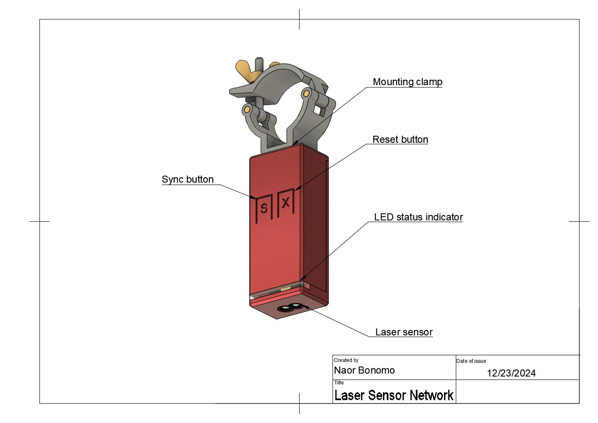

# Hardware Drawing Documentation

## Sensor Node Components

The sensor node consists of the following key components:

1. **Mounting Clamp**
   - Securely attaches the sensor to trusses
   - Adjustable grip strength

2. **Reset Button**
   - Hardware reset functionality
   - Used for device pairing and troubleshooting

3. **Sync Button**
   - Initiates device synchronization
   - Used for network pairing

4. **LED Status Indicator**
   - Displays device operational status
   - Color codes:
     - Green: Connected and operational
     - Blue: Syncing/Pairing mode
     - Red: Error state
     - Blinking: Data transmission

5. **Laser Sensor**
   - High-precision distance measurement
   - Operating range: up to 50m
   - Sampling rate: 1000Hz 