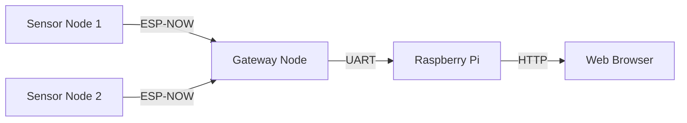

# Laser Sensor Network

A scalable IoT solution for real-time Laser distance monitoring, featuring wireless communication and web-based visualization.

## 🌟 Key Features

- Real-time distance monitoring using Laser sensors
- Wireless sensor network 
- Web-based dashboard for real-time data visualization
- Multi-sensor support with automatic discovery
- LED status indicators and remote control
- Configurable sampling rates
- Battery-optimized operation

## 🏗️ System Architecture

## 💻 Technology Stack

- **Hardware**
  - ESP32 Development Boards
  - Laser Sensors
  - Raspberry Pi 4
  - Custom 3D-printed enclosures

- **Software**
  - ESP32 Arduino Framework
  - Node.js Backend
  - Express.js Web Server
  - WebSocket for real-time updates

## 📸 Screenshots

Coming soon

## 🛠️ Setup Requirements

- VS Code  
- Node.js v14+
- Raspberry Pi with Raspbian OS(ubuntu)
- ESP32 development boards
- Laser sensors

## 🔒 Security Features

- Secure wireless communication
- Device pairing authentication
- Local web interface access control

## 📊 Performance

- Sampling rates up to 1000Hz
- Real-time data transmission
- Low-latency updates (<100ms)

## 🎯 Use Cases

- Distance monitoring systems
- Object detection
- Motion tracking
- Industrial automation
- Safety systems
## 📚 Documentation

- [Hardware Setup Guide](docs/hardware.md)
- [API Documentation](docs/api.md)
- [Troubleshooting Guide](docs/troubleshooting.md)

## 📝 License

Private